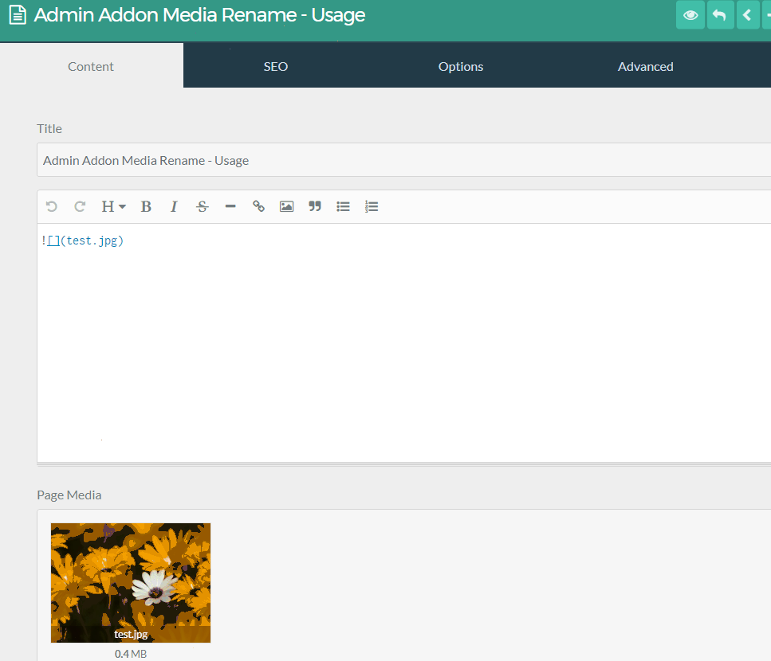

# Admin Addon Media Rename Plugin

The **Admin Addon Media Rename** Plugin is for [Grav CMS](http://github.com/getgrav/grav). A simple plugin which adds the option to rename media files in the admin panel.

## Installation

Installing the Admin Addon Media Rename plugin can be done in one of two ways. The GPM (Grav Package Manager) installation method enables you to quickly and easily install the plugin with a simple terminal command, while the manual method enables you to do so via a zip file.

### GPM Installation (Preferred)

The simplest way to install this plugin is via the [Grav Package Manager (GPM)](http://learn.getgrav.org/advanced/grav-gpm) through your system's terminal (also called the command line).  From the root of your Grav install type:

    bin/gpm install admin-addon-media-rename

This will install the Admin Addon Media Rename plugin into your `/user/plugins` directory within Grav. Its files can be found under `/your/site/grav/user/plugins/admin-addon-media-rename`.

### Manual Installation

To install this plugin, just download the zip version of this repository and unzip it under `/your/site/grav/user/plugins`. Then, rename the folder to `admin-addon-media-rename`. You can find these files on [GitHub](https://github.com/david-szabo97/grav-plugin-admin-addon-media-rename) or via [GetGrav.org](http://getgrav.org/downloads/plugins#extras).

You should now have all the plugin files under

    /your/site/grav/user/plugins/admin-addon-media-rename
	
> NOTE: This plugin is a modular component for Grav which requires [Grav](http://github.com/getgrav/grav) and the [Admin](https://github.com/getgrav/grav-plugin-admin) plugin to operate.

## Usage

After installation just simply click on the names of the media to rename them.

